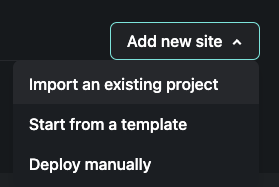
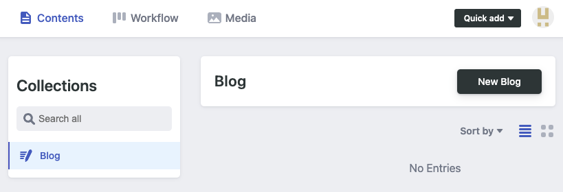

블로그를 한번 만들어서 시작을 하고 싶은데 아직은 크게 돈이 안드는 방법으로 블로그를 운영할 방법을 찾다 보니 Gatsby와 Netlify cms를 사용하게 되었습니다. 블로그를 만드는 방법 부터 만들다 배운 점 까지 다 한번에 알아 보도록 하겠습니다.

목차

* Gatsby는 무엇인가 ?
* Netlify는 무엇이고 왜 필요한가?
* 블로그 만드는데 필요한 NPM packages
* 마크다운 스타일 적용하기
* Editor Draft 적용하기
* Netlify 배포해보기
* Graphql 플레이 그라운드 배워보기
* 블로그에 코멘트 기능 추가하기

## **`Gatsby는 무엇인가?`**

Gatsby는 static page generation을 도와주는 React 기반에 framework입니다. 모든 페이지를 static으로 미리 만들어지기 때문에 페이지 페이지 로딩 속도도 아주 빠릅니다. 데이터는 graphql 기반으로 페이지로 가져오게 됩니다. 많은 cms와 연결해서 사용 할 수 있습니다.

## **Netlify는 무엇인가 ?**

개발팀에 워크플로우를 간편하게 만들어주는 플랫폼입니다. Netlify는 호스팅, 파이프라인, static page 프리뷰 등을 제공 합니다. 또한 netlify는 많은 호스팅 사트에서는 유료 서비스인 SSL certificates을 무료로 제공합니다.(Let's encrypt).

Gatsby와 Netlify를 선택한 이유?

Gatsby는 꽤 오랫동안 유지 보수되고 있는 프로젝트이고 많은 플러그 인들이 존재 하기 때문에 여러 기능들을 간편하게 설치가 가능하고 Netlify를 통해서 블로그를 관리하면 도메인 구매 비용 말고는 비용도 발 생하지 않기 때문. 또한 예전에 몇번 개인 프로젝트를 gatsby와 netlify를 사용해본 경험이 있기 때문에 Learning curve도 적을 것 같아서 선택하게 되었다.

프로젝트 셋업 및 사용하는 NPM pakcages 설명

```
npm install -g gatsby-cli
```

기본적인 세팅은 cli를 따라서 하면 됩니다. 

우리는 tailwind를 사용할 것이기 때문에 다른 css framework은 사용하지 않도록 하겠습니다.

gatsby에는 많은 플러그 인들이 있습니다. 일단은 markdown을 기반으로 블로그 글을 작설해서 페이지에 보여주는데 필요한 플러그 인들을 설치해보겠습니다.

```javascript
yarn add gatsby-plugin-alias-imports gatsby-remark-images gatsby-plugin-mdx slugify reading-time
```

https://github.com/remarkjs/remark/blob/main/doc/plugins.md#list-of-plugins

블로그를 글을 쓰고 관리하는데 netlify-cms를 사용합니다. 일단 코드를 git repo에 올리고 netlify에 배포 시켜보도록 하겠습니다.

```
git init
git commit -m "first commit"
git branch -M main
git remote add origin git@github.com:username/gatsby-dev-blog-template.git
git push -u origin main
```

이제 github에 가서 방금 push한 코드가 제대로 push되어 있는지 확인해 봅시다.

그리고 나서 netlify에 로그인을 한뒤 Add new site 버튼을 누른뒤 import an existing project를 선택해 줍니다.



Netlify는 github말고도 다른 git provider에 있는 프로젝트도 가져올 수 있습니다. 하지만 지금은 github를 사용하고 있으니 github버튼을 눌러서 다음 화면으로 넘어 가겠습니다.


아마 맨 처음에는 브랜치가 보이지 않을 텐데 검색해서 나오지 않는 다면 설정을 변경해줘야 합니다. 아래 보이는 이미지 처럼 \`Configure the Netlify app on Github\` 버튼을 눌러서 설정을 변경 할 수 있습니다.


특별히 변경한 것 없이 잘 따라 하고 있으면 아래 설정을 안 바꿔도 됩니다. `Deploy Site` 를 눌러주고 다음으로 넘어 가겠습니다.


이제 다시 홈페이지로 가셔서 현재 프로젝트를 선택하고 사이트 URL을 눌러 보시면 사이트가 웹에 올라 간 것을 볼 수 있습니다.

이제 netlify에는 사이트를 올렸으니 다음으로는 netlify-cms를 설정해 보겠습니다. 먼저 cms를 사용하려면 admin config.yml를 설정해야 합니다. 

먼저 프로젝트 root레벨에 static/admin/config.yml를 만들어 줍니다.

```
backend:
  # github를 통해서 로그인을 하고 싶다면 github를 이름에 쓰면되고 다른 signup/login을 사용하고 싶으면
  # name: git-gateway
  name: github
  repo: username/gatsby-dev-blog-template
  branch: main

media_folder: static/assets
public_folder: /assets
# draft / in review / ready mode 추가
publish_mode: editorial_workflow

collections:
  - name: blog
    label: Blog
    folder: blog
    create: true
    fields:
      - { name: path, label: Path }
      - { name: date, label: Date, widget: datetime }
      - { name: title, label: Title }
      - { name: description, label: Description }
      - { name: body, label: Body, widget: markdown }
      - { name: category, label: Category, widget: 'select', options: ["Javascript", "Typescript", "CSS"] }
      - { name: tags, label: Tags,  widget: list }
```

editorial_workflow를 추가하면 publish를 하지 않고 저장 기능이 추가 됩니다. 워드프레스, 티스토리 같은 블로드 들도 초안 모드나 비공계 모드를 사용할 수 있는데 editorial_workflow를 통해서 그 기능을 추가 할 수 있습니다.


설정이 다 끝났다면 이제 다시 `gatsby develop`을 실행 한뒤 /admin url로 가면 github를 통해서 로그인 하라는 팝업이 뜨고 다음과 같이 블로그 글을 적을 수 있는 어드민 dash보드가 나옵니다.




마크다운 스타일 정하기

Netlify 배포해보기

이제 간단한 셋업을 마쳤으니 Netlify에 배포를 해보려고 한다.