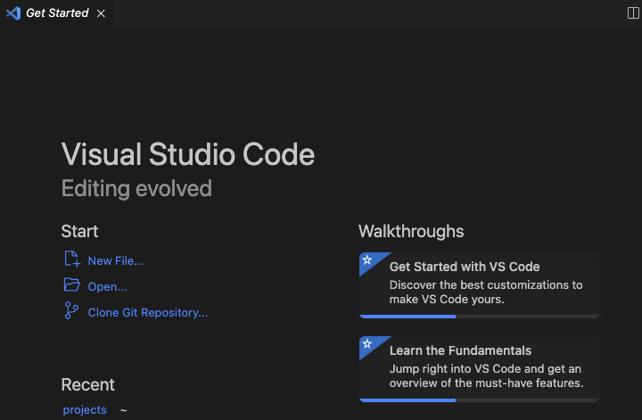
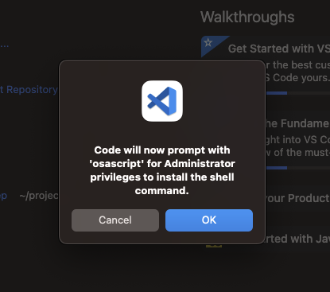

웹 계발을 하는데 요즘에는 필수인 Visual Studio Code를 설치하고 예전에 사용하던 회사 컴퓨터 처럼 . code로 프로젝트를 쉽게 열어 보려고 했습니다. 하지만 . code를 터미널에서 실행하니 아래와 같이 프로젝트가 열리지 않았습니다. 회사 컴퓨터로는 매번 같은 프로젝트를 열어서 자주 사용하지 않았는데 새로운 맥을 세팅 하고 여러가지 하다보니 code .에 필요성을 느낌니다.

```
zsh: command not found: code
```

터미널에서 code를 통해서 프로젝트를 vscode로 여는 방법은 생각보다 간단 합니다. 먼저 
vscode를 실행 시켜줍니다. 



실행 되었으면 `Shift + Command + P`를 입력하면 검색창이 뜨는데 거기에 

```
Shell Command: Install
```

을 입력하면 아래와 같이 창이 뜨고 본인 어카운트 패스워드를 입력하면 code를 이제 terminal에서 사용 할 수 있게 됩니다.




이제 터미널을 열서 한번 \`code .\`를 입력해 봅시다. 

여러 가이드을 따라하면 한번에 잘 될때가 없지만 제가 쓴 방법은 한번에 되길 바라겠습니다. 

Visual Studio 설치하는 방법도 나중에 한번 알아 보겠습니다.